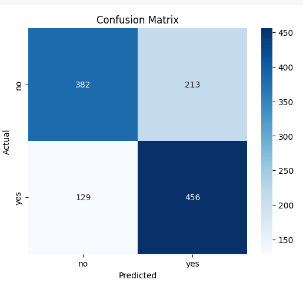
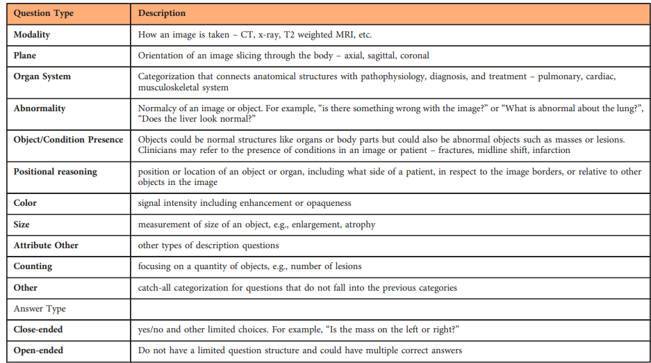

# Quantitative Analysis

-   GPT-4o has a balanced recall for both yes/no classes
-   Qwen 2.5 VL has a high precision for "yes" (0.87) but low recall (0.48), which suggests it's over-cautious in saying “yes”. It says "no" too often and achieves a high no recall, which shows it is biased
-   LLaMA 3.2 is even more biased: recall for "no" is high (0.85), but recall for "yes" is only 0.35, and it has lower precisions than Qwen 2.5 VL

## GPT-4o

```
closed-ended questions in sample: 1299  
closed-ended questions in sample where expected answer is yes/no: 1193  
rows discarded: 13 (model answer is not yes/no)  
valid rows: 1180
yes: 585
no: 595
```

### Confusion Matrix



### Classification Report

```
Strict Accuracy: 71.02%
Classification Report:

              precision    recall  f1-score   support

          no       0.75      0.64      0.69       595
         yes       0.68      0.78      0.73       585

    accuracy                           0.71      1180
   macro avg       0.71      0.71      0.71      1180
weighted avg       0.71      0.71      0.71      1180
```

### F1 Score by Question Type

```
   question_type  f1_score  count
5          ORGAN  0.967742     17
4       MODALITY  0.960000     72
7          PLANE  0.925373     53
8            POS  0.833333     21
1         ATTRIB  0.819672     47
6          OTHER  0.754098     51
9           PRES  0.706815    624
3          COUNT  0.666667     10
11          SIZE  0.662500    157
2          COLOR  0.600000     32
0            ABN  0.541667    116
10          PRSE  0.000000      1
```

## Gemini 2.5 Pro  

```
closed-ended questions in sample: 1299  
closed-ended questions in sample where expected answer is yes/no: 1193  
rows discarded: 101 (model answer is not yes/no)  
valid rows: 1092
yes: 537
no: 555
```

### Confusion Matrix


### Classification Report

```
Strict Accuracy: 75.64%
Classification Report:

              precision    recall  f1-score   support

          no       0.80      0.70      0.75       555
         yes       0.72      0.81      0.77       537

    accuracy                           0.76      1092
   macro avg       0.76      0.76      0.76      1092
weighted avg       0.76      0.76      0.76      1092
```

### F1 Score by Question Type

```
   question_type  f1_score  count
5          ORGAN  0.967742     17
4       MODALITY  0.960000     72
7          PLANE  0.925373     53
8            POS  0.833333     21
1         ATTRIB  0.819672     47
6          OTHER  0.754098     51
9           PRES  0.706815    624
3          COUNT  0.666667     10
11          SIZE  0.662500    157
2          COLOR  0.600000     32
0            ABN  0.541667    116
10          PRSE  0.000000      1
```


## Qwen 2.5 VL 7b

```
closed-ended questions in sample: 1299  
closed-ended questions in sample where expected answer is yes/no: 1193  
rows discarded: 0 (model answer is not yes/no)  
valid rows: 1193  
yes: 587  
no: 606  
```

### Confusion Matrix


### Classification Report

```
Strict Accuracy: 71.00%
Classification Report:

              precision    recall  f1-score   support

          no       0.65      0.93      0.77       606
         yes       0.87      0.48      0.62       587

    accuracy                           0.71      1193
   macro avg       0.76      0.71      0.69      1193
weighted avg       0.76      0.71      0.69      1193
```

### F1 Score by Question Type

```
   question_type  f1_score  count
4       MODALITY  0.924731     72
7          PLANE  0.906250     53
5          ORGAN  0.857143     17
3          COUNT  0.833333     10
1         ATTRIB  0.636364     47
8            POS  0.625000     21
9           PRES  0.575406    631
11          SIZE  0.495575    157
2          COLOR  0.461538     32
6          OTHER  0.439024     52
0            ABN  0.411765    121
10          PRSE  0.000000      1
```

## Llama 3.2 Vision 11b

```
closed-ended questions in sample: 1299  
closed-ended questions in sample where expected answer is yes/no: 1193  
rows discarded: 120 (model answer is not yes/no)  
valid rows: 1073
yes: 528
no: 545
```

### Confusion Matrix


### Classification Report

```
Strict Accuracy: 60.48%
Classification Report:

              precision    recall  f1-score   support

          no       0.57      0.85      0.69       545
         yes       0.70      0.35      0.46       528

    accuracy                           0.60      1073
   macro avg       0.64      0.60      0.58      1073
weighted avg       0.63      0.60      0.58      1073
```

### F1 Score by Question Type

```
   question_type  f1_score  count
4       MODALITY  0.696970     65
5          ORGAN  0.666667     15
3          COUNT  0.545455      8
6          OTHER  0.536585     44
7          PLANE  0.523810     48
9           PRES  0.445013    571
0            ABN  0.437500    108
11          SIZE  0.420000    141
8            POS  0.375000     19
2          COLOR  0.320000     27
1         ATTRIB  0.294118     43
10          PRSE  0.000000      1
```

# Comparison between models

Dataset of F1-score by question type  
```csv
model,question_type,f1_score,count
gpt-4o,ORGAN,0.967742,17
gpt-4o,MODALITY,0.960000,72
gpt-4o,PLANE,0.925373,53
gpt-4o,POS,0.833333,21
gpt-4o,ATTRIB,0.819672,47
gpt-4o,OTHER,0.754098,51
gpt-4o,PRES,0.706815,624
gpt-4o,COUNT,0.666667,10
gpt-4o,SIZE,0.662500,157
gpt-4o,COLOR,0.600000,32
gpt-4o,ABN,0.541667,116
qwen2.5vl,MODALITY,0.924731,72
qwen2.5vl,PLANE,0.906250,53
qwen2.5vl,ORGAN,0.857143,17
qwen2.5vl,COUNT,0.833333,10
qwen2.5vl,ATTRIB,0.636364,47
qwen2.5vl,POS,0.625000,21
qwen2.5vl,PRES,0.575406,631
qwen2.5vl,SIZE,0.495575,157
qwen2.5vl,COLOR,0.461538,32
qwen2.5vl,OTHER,0.439024,52
qwen2.5vl,ABN,0.411765,121
llama3.2vision,MODALITY,0.696970,65
llama3.2vision,ORGAN,0.666667,15
llama3.2vision,COUNT,0.545455,8
llama3.2vision,OTHER,0.536585,44
llama3.2vision,PLANE,0.523810,48
llama3.2vision,PRES,0.445013,571
llama3.2vision,ABN,0.437500,108
llama3.2vision,SIZE,0.420000,141
llama3.2vision,POS,0.375000,19
llama3.2vision,COLOR,0.320000,27
llama3.2vision,ATTRIB,0.294118,43
gemini-2.5-pro,MODALITY,0.930233,65
gemini-2.5-pro,ORGAN,0.928571,16
gemini-2.5-pro,PLANE,0.888889,50
gemini-2.5-pro,ATTRIB,0.821429,46
gemini-2.5-pro,OTHER,0.766667,47
gemini-2.5-pro,PRES,0.760000,571
gemini-2.5-pro,COUNT,0.714286,10
gemini-2.5-pro,SIZE,0.705882,145
gemini-2.5-pro,COLOR,0.702703,28
gemini-2.5-pro,ABN,0.693069,114
gemini-2.5-pro,POS,0.666667,20
```

# Terms



MODALITY  
PLANE  
ORGAN (Organ System)  
ABN (Abnormality)  
PRES (Object/Condition Presence)  
POS (Positional Reasoning)  
COLOR  
SIZE  
ATTRIB (Attribute Other)  
COUNT (Counting)  
Other  
